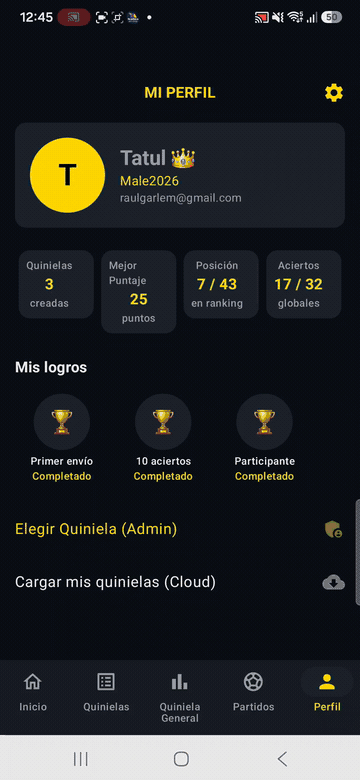
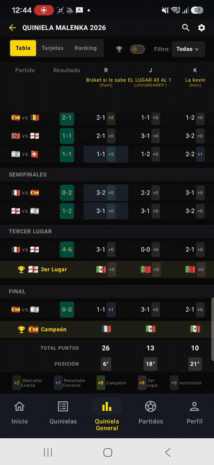
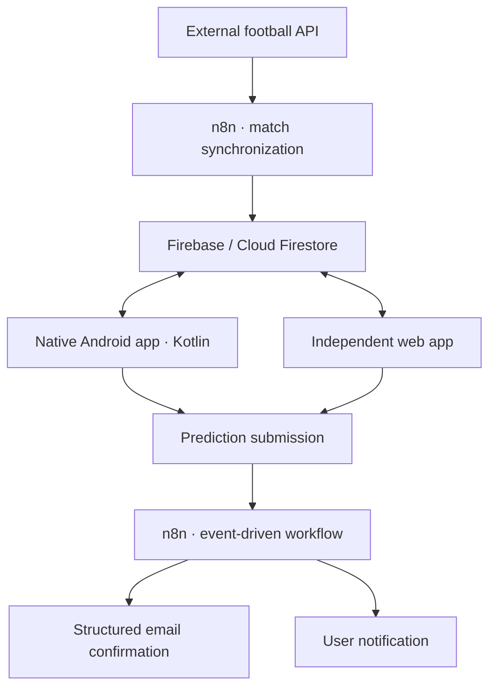

# ⚽ Quiniela Malenka 2026

<p align="center">
  <strong>Native Android and web prediction platform for the 2026 World Cup.</strong><br>
  Predictions, live tournament data, scoring, rankings and automated confirmations in one shared ecosystem.
</p>

<p align="center">
  
  
  
  
</p>

> This repository contains the **native Android client**. Quiniela Malenka also has an independent web client; both applications share tournament and participant data through Firebase and the automation backend.

## Demo

<p align="center">
  
  &nbsp;&nbsp;
  
</p>

<p align="center"><sub>Prediction and profile flow · Dynamic tournament ranking</sub></p>

## The project

A traditional football pool becomes difficult to operate when predictions, results and dozens of participants must be updated by hand. The 2026 World Cup adds another layer of complexity: **104 matches**, several knockout stages, simultaneous games and venues across multiple time zones.

Quiniela Malenka turns that process into a multi-platform product. Players create and manage their predictions from Android or the web, while cloud workflows synchronize tournament data, calculate standings and send submission confirmations with minimal manual intervention.

## Key features

- Full tournament flow: group stage, round of 32, round of 16, quarter-finals, semi-finals, third-place match, final and champion.
- Multiple saved and submitted quinielas per user.
- Predictions for match scores, group winners and knockout outcomes.
- Configurable scoring with exact-score and correct-result bonuses.
- Global ranking, group tables, cards and tournament bracket views.
- Cloud synchronization with offline persistence through Room.
- Profiles with personal statistics, ranking position and achievements.
- Admin-controlled competition phases and visibility.
- Automated match updates, email confirmations and user notifications.

## Android app

The mobile client is a native Kotlin application—not a WebView wrapper. Its interface is built entirely with Jetpack Compose and Material 3, with state-driven navigation across the home, quiniela, matches, ranking and profile experiences.

### Android stack

| Layer | Technology |
| --- | --- |
| Language and UI | Kotlin, Jetpack Compose, Material 3 |
| Architecture | ViewModel, repository pattern, Kotlin Flow and Coroutines |
| Local data | Room |
| Cloud data | Firebase Cloud Firestore |
| Navigation | Navigation Compose |
| Serialization | Gson |
| Build | Gradle Kotlin DSL, KSP |
| Compatibility | Android 7.0+ (API 24), target API 36 |

### Mobile experience

- Browse the complete fixture by phase and follow match status and results.
- Create group-stage and knockout predictions with automatic match locking.
- Save a draft locally, submit it to the cloud and restore it in another session.
- Compare participants in table, card and bracket formats.
- Track personal totals, correct predictions and current position.
- Switch between competition groups using access codes managed from Firestore.

## Web app

The independent web client provides another entry point to the same competition. It supports user profiles, prediction registration, submitted quinielas, tournament information and shared Firebase synchronization.

Keeping both clients independent made it possible to design platform-specific experiences while preserving a common data model and a single source of truth for tournament results.

## System architecture



### Automated match synchronization

A scheduled n8n workflow detects the day's matches and starts tracking only when necessary. API responses are validated and normalized into the internal Firestore model, including status, score, minute, venue, kickoff time and tournament phase.

Each match is processed by its own identifier so simultaneous games cannot overwrite one another. Failed requests enter a controlled retry path, and polling stops once a match is marked as finished.

### Multi-time-zone processing

Tournament venues span Mexico, the United States and Canada. The backend maps stadiums to their corresponding North American time zone and converts kickoff data to a consistent representation before clients display it.

### Submission automation

Submitting a quiniela triggers an event-driven workflow. The submission is persisted and the participant receives immediate feedback plus a structured email record of the selected scores, advancing teams and champion.

## Shared data model

A simplified match document looks like this:

```ts
interface Match {
  matchCode: string;
  matchNumber: number;
  phase: string;
  homeTeam: string;
  awayTeam: string;
  homeScore: number;
  awayScore: number;
  kickoffMxIso: string;
  status: "SCHEDULED" | "LIVE" | "FINISHED";
  minute: number;
  stadium: string;
  finished: boolean;
}
```

Firestore also stores users, quinielas, predictions, ranking configuration, access codes and tournament metadata.

## Engineering highlights

- Models an entire 104-match competition instead of a single prediction form.
- Normalizes external API data before exposing it to either client.
- Uses reactive streams to keep Compose screens aligned with Room and Firestore state.
- Handles concurrent matches as independent workflow executions.
- Combines offline-friendly local storage with cloud recovery and synchronization.
- Separates scoring rules from presentation so rankings can be reused across views.
- Uses event-driven workflows for confirmations instead of manual administration.

## Project structure

```text
.
├── app/src/main/java/.../
│   ├── data/                 # Firestore repository and Room persistence
│   ├── model/                # Match and ranking domain models
│   ├── ui/
│   │   ├── components/       # Reusable Compose UI
│   │   ├── navigation/       # App destinations
│   │   ├── screens/          # Product screens
│   │   └── theme/            # Material theme
│   └── util/                 # Scoring and match-state rules
├── app/src/main/res/         # Android resources
├── assets/                   # Portfolio demos
└── README.md
```

## Run the Android project

### Requirements

- Android Studio with JDK 11 or newer.
- Android SDK 36.
- An emulator or physical device running Android 7.0 or newer.
- A Firebase project and a valid `app/google-services.json` for cloud features.

### Setup

1. Clone the repository.
2. Open the root folder in Android Studio.
3. Add your Firebase Android configuration as `app/google-services.json`.
4. Sync Gradle and run the `app` configuration.

You can also compile a debug build from the terminal:

```bash
./gradlew assembleDebug
```

On Windows, use `gradlew.bat assembleDebug`.

## Security

This repository is a portfolio representation of the project. Production API keys, service accounts, n8n credentials, private endpoints and environment variables must remain outside version control. Use your own Firebase configuration when running the app locally.

## What I learned

Building Quiniela Malenka brought together native Android development, web product design, NoSQL modeling, REST integration, workflow orchestration, fault-tolerant synchronization, time-zone handling and application distribution. The central challenge was not a single screen—it was keeping independent systems consistent around a live, continuously changing tournament.

## Author

**Raúl García Lemus**<br>
Mechatronics Engineer · Software Engineering · Embedded Systems · Digital Signal Processing

---

<p align="center">Built for the excitement of the 2026 World Cup 🏆</p>
